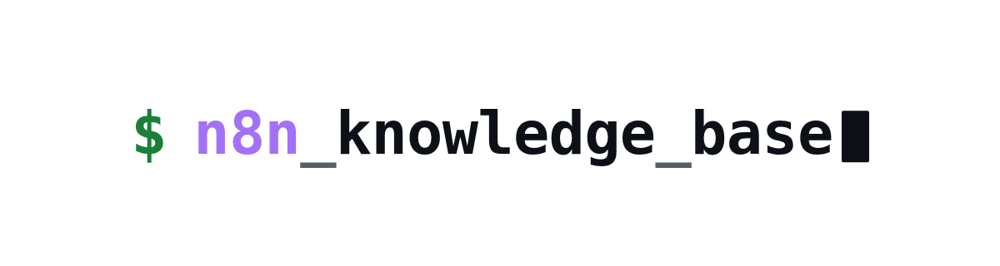
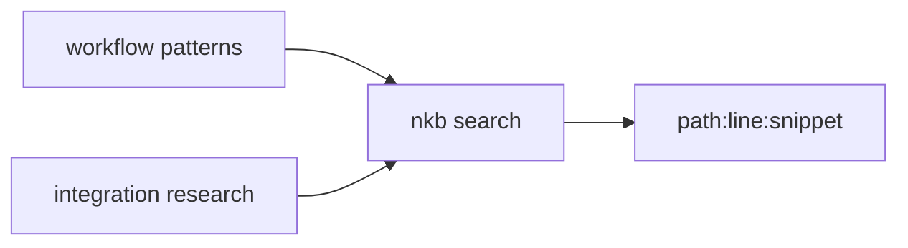

<div align="center">

<picture>
  <source media="(prefers-color-scheme: dark)" srcset="docs/brand/n8n-knowledge-base-wordmark-dark.png">
  <source media="(prefers-color-scheme: light)" srcset="docs/brand/n8n-knowledge-base-wordmark-light.png">
  
</picture>

#### full-text search CLI · n8n failure-mode patterns · voice-agent patterns · integration research records · no build step

# The nkb search CLI over an n8n agent-knowledge catalog

**[Quick start](#-quick-start) | [Features](#-features) | [What it covers](#-what-it-covers) | [Conventions](docs/conventions.md) | [License](#license)**

**❤️ [Sponsor this project](https://github.com/sponsors/wranngle) ❤️**

[](https://github.com/wranngle/n8n_knowledge_base/actions/workflows/ci.yml)
[](LICENSE)
[](https://github.com/wranngle/n8n_knowledge_base/commits/main)
[](https://github.com/wranngle/n8n_knowledge_base/graphs/contributors)

[](https://github.com/wranngle/n8n_knowledge_base/stargazers)
[](https://github.com/wranngle)
</div>

---



*One query in, path and line out.*

n8n_knowledge_base is a catalog of 35 n8n operating docs with a single-file search CLI, `nkb`, on top. One command returns path, line, and snippet hits across hand-written workflow failure-mode patterns and per-vendor integration research records. Plain Node, one dependency, no build step.

## 🔎 Features

- 🔍 **Full-text search**: `nkb search "<query>"` greps the whole catalog and prints `path:line:snippet` hits; `--tag` narrows by front-matter tag.
- 🧹 **Catalog lint**: `nkb lint` checks every failure-mode doc for required front-matter.
- 📇 **Integration research records**: native n8n node name, auth type, complexity tier, and estimated hours per vendor. [How a record gets made](docs/research-waterfall.md) documents the research waterfall, the complexity rubric, and the tier-to-hours mapping behind those fields.
- 🧯 **5 failure-mode pattern docs**: symptom, root cause, and workaround for real n8n and voice-agent failures, plus a community-template index.
- 🕸️ **Standalone tooling**: dependency graph, dedupe detection, adoption stats, JSON-LD export, and an HTTP search shim ship as `node scripts/*.mjs` commands.

## 🗺️ How a query flows



## 🚀 Quick start

1. Clone and install

   ```bash
   git clone https://github.com/wranngle/n8n_knowledge_base && cd n8n_knowledge_base
   npm install
   ```

2. Ask it something

   ```bash
   node scripts/nkb.mjs search "twilio 11200"
   ```

3. Optional: put `nkb` on your PATH

   ```bash
   npm link
   nkb search --tag failure-mode
   ```

<details>
<summary>Real search and lint output</summary>

```
$ node scripts/nkb.mjs search "twilio 11200"
workflow-patterns/twilio-11200-stream-disconnect.md:5:# Twilio Error 11200 on Media Streams...

$ node scripts/nkb.mjs lint
lint ok: 6 failure-mode doc(s) checked
```

</details>

## 📚 What it covers

<table>
<tr>
<td align="center" width="50%"><b>Integration research</b><br/>25 vendor records, each with native n8n node, auth type, complexity tier, and estimated hours: HubSpot, Salesforce, Twilio, Slack, Shopify, Calendly, RingCentral, Google Ads, Google Calendar, Outlook, SQL, Excel, and more</td>
<td align="center" width="50%"><b>Failure-mode patterns</b><br/>webhook cold-start timeouts, cross-workflow error monitoring, Twilio Error 11200 stream disconnects, ElevenLabs tool-name collisions, voice-agent workflow patterns</td>
</tr>
</table>

Point `nkb search` at it and ask it anything n8n. Named vendors are catalog entries, not integrations.

## 🧰 More verbs

| Command | What it does |
| --- | --- |
| `node scripts/nkb-graph.mjs` | Doc dependency graph, JSON or Mermaid output |
| `node scripts/nkb-dedupe.mjs` | Near-duplicate detection across the catalog |
| `node scripts/nkb-submit.mjs` | Pattern intake |
| `node scripts/nkb-run.mjs <slug> --sandbox` | Sandboxed pattern runner |
| `node scripts/nkb-stats.mjs` | Adoption stats |
| `node scripts/nkb-export.mjs --jsonld` | JSON-LD catalog export |
| `node scripts/nkb-serve.mjs` | HTTP search shim on localhost |
| `node scripts/build-index.mjs` | Rebuilds the search index |
| `node scripts/lint-citations.mjs` | Citation lint |

## ⭐ Star history

[](https://www.star-history.com/#wranngle/n8n_knowledge_base&Date)

[**View the interactive star history**](https://www.star-history.com/#wranngle/n8n_knowledge_base&Date)

## License

MIT. See [LICENSE](LICENSE).
